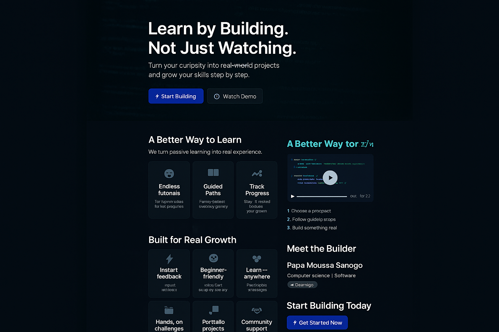

# 🚀 BuildPath

### Learn by Building. Not Just Watching.

BuildPath is a learning platform that helps beginners gain real-world programming skills by building practical projects instead of just watching tutorials.

---

## 🌍 The Problem

Many students struggle to learn programming effectively because:

- 😕 Tutorials feel overwhelming and disconnected  
- 📚 Learning is too theoretical  
- 🧭 There’s no clear path to follow  

As a result, learners lose motivation and never build real projects.

---

## ✨ Our Solution

BuildPath transforms learning into action.

With BuildPath, users can:

- ✅ Build real-world projects  
- ✅ Follow structured learning paths  
- ✅ Track their progress step-by-step  
- ✅ Stay motivated with guided challenges  

Instead of passive learning, users actively create — building confidence and real skills.

---

## 🎥 Demo

👉 https://www.youtube.com/watch?v=5e8KPTn_Y9Y

---

## 🧠 How It Works

1. Choose a project  
2. Follow guided steps  
3. Build something real  

---

## 🛠️ Tech Stack *(edit this if needed)*

- Frontend: HTML, CSS, JavaScript  
- Backend: *(add if you have one)*  
- Tools: GitHub, VS Code  

---

## 👨‍💻 Author

**Papa Moussa Sanogo**  
- Computer Science / Software Engineering  
- GitHub: https://github.com/psanogo  

---

## 🌱 Vision

We believe the best way to learn is by building.

BuildPath helps turn beginners into creators.
``
---

## 📸 Screenshots

### 🏠 Homepage

### 📚 Learning Dashboard

### 🛠️ Project Builder

``
<section class="section">
  <h2>🎥 See BuildPath in Action</h2>
  <iframe width="560" height="315"
    src="https://www.youtube.com/embed/5e8KPTn_Y9Y"
    frameborder="0"
    allowfullscreen>
  </iframe>
</section>
``
<section class="section">
  <h2>A Better Way to Learn</h2>
  

    
🛠️ Build real projects

    
🧭 Follow clear paths

    
📈 Track progress

  

</section>
<section class="section" style="text-align:center;">
  <h2>Start Building Today</h2>
  
Stop watching. Start creating.

  <button>🚀 Get Started</button>
</section>
``
